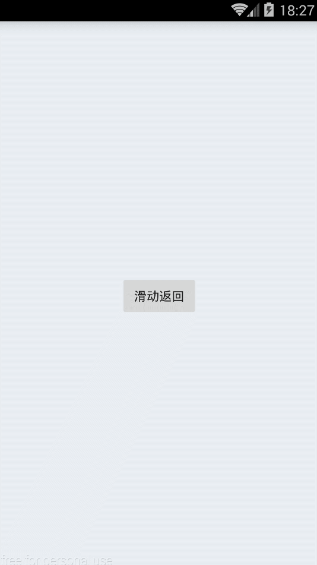

# SwipeBack
高仿最新版微信6.2手势滑动返回

##优势
  
1.将BaseSwipeBackActivity基类名改成BaseActivity，改成通过isSupportSwipeBack方法来告知是否开启手势滑动返回   
2.解决ActionBar不随手势滚动的bug   
3.可设置是否需要滑动返回api   
4.无需设置theme背景透明等等属性。只需要继承BaseActivity  
5.不影响activity的生命周期

**新版效果图如下**

